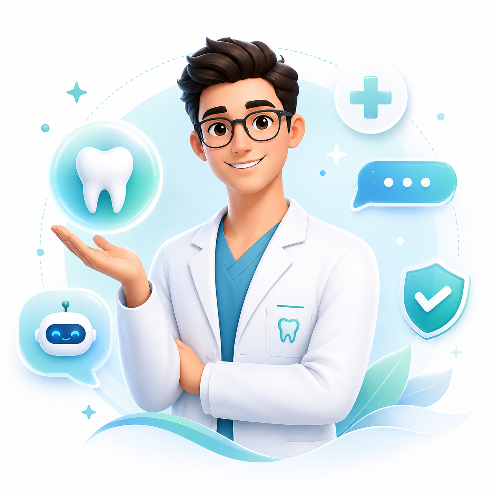

# Dental RAG Chatbot

## Overview

Dental RAG Chatbot is a public-safe AI chatbot web application built for dental support websites. It combines a polished Next.js frontend, a FastAPI backend, and a Qdrant-ready retrieval layer to deliver source-backed educational answers without exposing private patient or insurance account data.

## Key Features

- Public-facing dental support chatbot interface
- Safe-answering model focused on general educational guidance
- FastAPI backend with chat and health endpoints
- Qdrant-ready RAG pipeline for source-backed answers
- PDF knowledge-base ingestion workflow
- Admin-only knowledge submission flow with pending review
- Mobile-friendly frontend experience with polished UX
- Safe handoff patterns for private or case-specific requests

## Tech Stack

- Next.js
- TypeScript
- Tailwind CSS
- Framer Motion
- FastAPI
- Qdrant
- OpenAI
- pypdf

## Business Use Case

This project is well suited for dental clinics, dental support websites, or healthcare organizations that want an AI chatbot for public FAQ guidance, claim education, and support deflection without giving the assistant access to sensitive patient records.

## Repository Structure

- `app/` - frontend pages and landing experience
- `components/` - chat UI and landing page components
- `backend/` - FastAPI API, RAG services, and ingestion scripts
- `Doc/` - approved public dental support documents
- `public/` - static assets

## Preview



## Setup

### Frontend

```bash
npm install
npm run dev
```

If your backend is not running at `http://localhost:8000`, set `NEXT_PUBLIC_BACKEND_URL` before starting the frontend. Use `BACKEND_URL` for backend-side configuration if needed.

### Backend

```bash
python -m pip install -r backend/requirements.txt
python -m uvicorn backend.app.main:app --reload --port 8000
```

### Knowledge Ingestion

Set `QDRANT_URL` in `backend/.env`, then run:

```bash
python -m backend.app.scripts.ingest_knowledge_base
```

## Project Status

Active foundation project. The public chatbot experience, backend API, and retrieval workflow are already in place, with room to expand the admin, analytics, and production-readiness layers.

Current MVP notes:

- Public navigation uses working section anchors and chat-open CTAs instead of stale demo links.
- Knowledge submission lives in the `/admin` route and requires `x-admin-api-key`.
- The admin page includes a small pending-review queue with approve and reject actions.
- Public chat and health routes remain open to visitors.

## Future Improvements

- Admin authentication for knowledge management
- Richer source citation and answer traceability in the UI
- Analytics for common questions and handoff events
- Production deployment guidance for Qdrant and backend services

## Developer Credit

- GitHub: [syed-daniyalH](https://github.com/syed-daniyalH)
